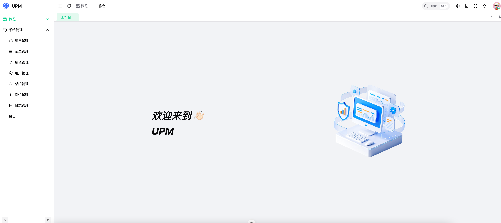
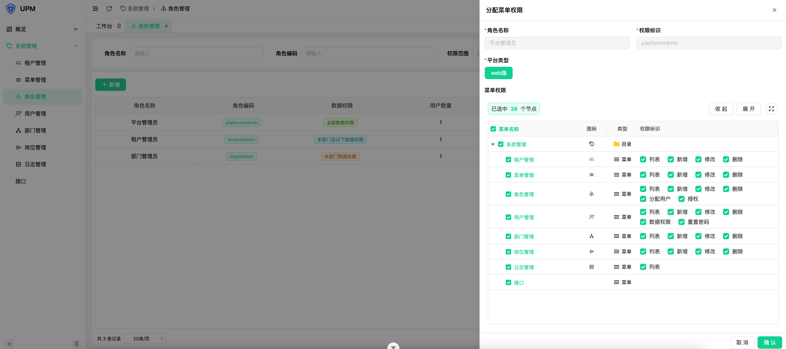
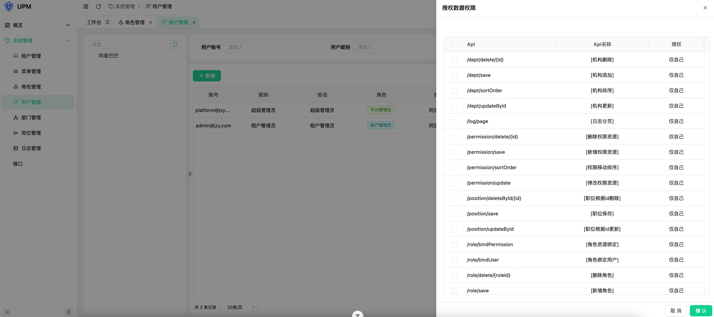
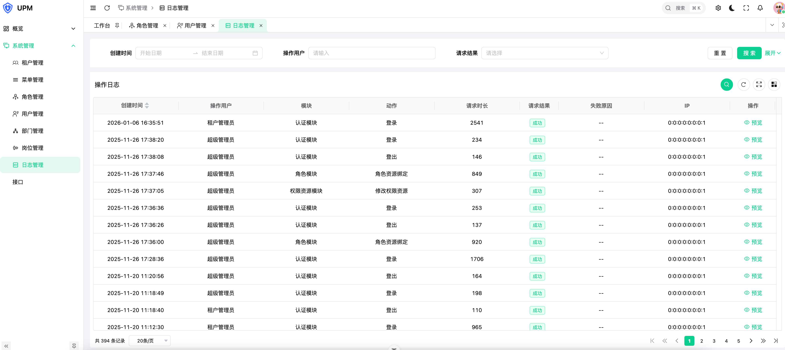

# infra-parent

```
JDK25
SpringBoot4.0.1

1. 租户
2. 菜单
3. 角色
4. 职位
5. 部门
6. 用户
7. 日志
```







```
.
├── bin
│   ├── install.sh
│   ├── deploy.sh
├── pom.xml
├── README.md
├── upm
│   ├── upm-core
│   │   ├── target
│   │   ├── pom.xml
│   │   ├── src
│   ├── upm-api
│   │   ├── target
│   │   ├── pom.xml
│   │   ├── src
│   ├── pom.xml
│   ├── upm-start
│   │   ├── target
│   │   ├── pom.xml
│   │   ├── src
├── common
│   ├── common-web
│   │   ├── target
│   │   ├── pom.xml
│   │   ├── src
│   ├── pom.xml
│   ├── common-auth
│   │   ├── target
│   │   ├── pom.xml
│   │   ├── src
│   ├── common-core
│   │   ├── target
│   │   ├── pom.xml
│   │   ├── src
│   ├── common-redisson
│   │   ├── target
│   │   ├── pom.xml
│   │   ├── src
├── sql

```

```bash
brew install tree

tree -L 3 -I "node_modules|.git|target|.idea" --dirsfirst

find . -maxdepth 3 \
  -not -path "./.git*" \
  -not -path "./node_modules*" \
  -not -path "./target*" \
  -not -path "./.idea*" \
  | sed 's|[^/]*/|│   |g;s|│   \([^│]\)|├── \1|'
```