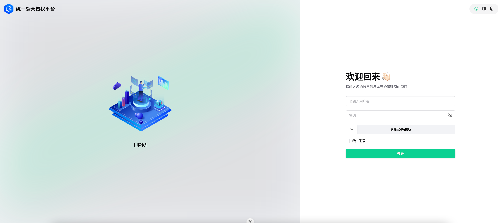
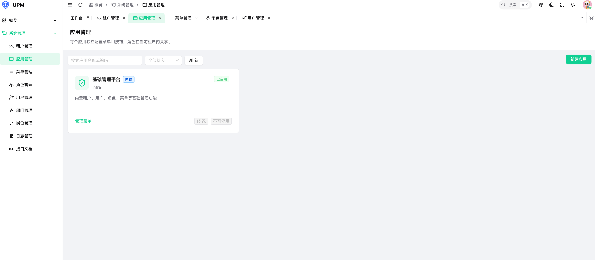
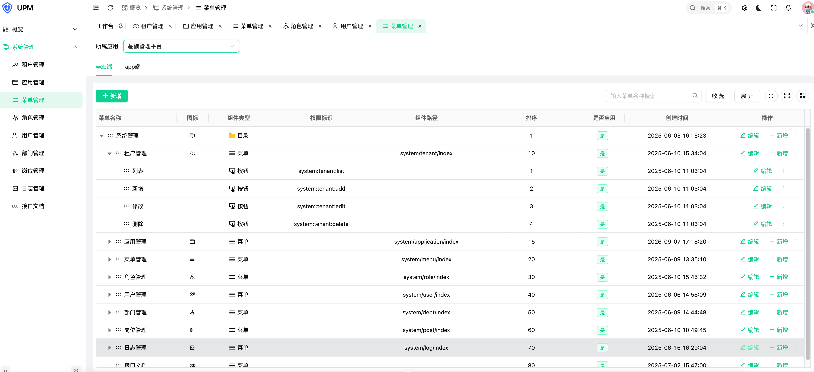
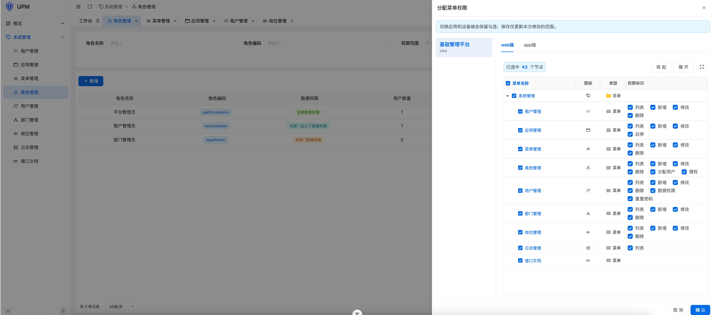
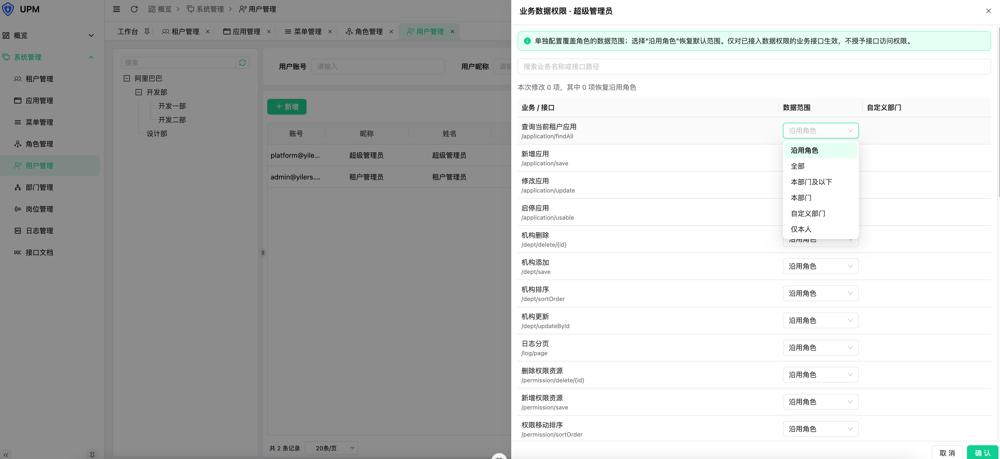

# infra-parent

infra-parent 是一个基于 Spring Boot 4.1.0 的基础服务项目，核心提供 RBAC 权限管理、多租户、数据权限、日志、缓存、文档和基础 Web 能力。项目既可以作为独立基础服务部署，也可以作为模块集成到业务服务中。

## 功能

- 租户管理
- 菜单和按钮权限管理
- 角色管理
- 职位管理
- 部门管理
- 用户管理
- 日志管理
- 数据权限控制
- AI 聊天模块

## 技术栈

| 类型 | 技术 |
| --- | --- |
| JDK | 25 |
| Web 框架 | Spring Boot 4.1.0 |
| ORM | MyBatis Plus 3.5.16 |
| 数据库 | MySQL 8.0+ |
| 缓存 | Redis、Redisson、JetCache |
| 权限认证 | Sa-Token |
| API 文档 | Knife4j |
| 线程池 | Dynamic-TP |
| 任务调度 | PowerJob |
| AI | Spring AI |

## 模块

```text
infra-parent
├── common
│   ├── common-core       # 基础工具和通用模型
│   ├── common-auth       # Sa-Token 认证授权封装
│   ├── common-redisson   # 分布式锁、限流、Redisson 配置
│   └── common-web        # Web、MyBatis Plus、异常、数据权限等能力
├── upm
│   ├── upm-api           # UPM API、实体、请求响应模型
│   ├── upm-core          # UPM 核心业务实现
│   └── upm-start         # UPM 启动模块
├── ai
│   └── ai-chatbot        # AI 聊天和工具调用模块
├── sql                   # 初始化 SQL
└── bin                   # 安装和部署脚本
```

## 快速开始

### 环境要求

- JDK 25
- Maven 3.9+
- MySQL 8.0+
- Redis 6.0+

### 初始化数据库

```bash
mysql -u root -p < sql/01.初始化.sql
```

### 修改配置

按本地环境修改：

```text
upm/upm-start/src/main/resources/application-dev.properties
```

至少需要配置 MySQL、Redis、Redisson 和 AI API Key。开源仓库建议把敏感配置改为环境变量或本地私有配置文件。

### 编译安装

```bash
mvn clean install -Drevision=1.0.0
```

也可以使用脚本：

```bash
cd bin
./install.sh
```

### 启动服务

```bash
cd upm/upm-start
mvn spring-boot:run -Dspring-boot.run.profiles=dev
```

启动后访问：

- 前端页面：http://localhost:9000/index.html
- API 文档：http://localhost:9000/doc.html

默认账号：

| 类型 | 账号 | 密码 |
| --- | --- | --- |
| 平台管理员 | platform@yilers.com | yilers@123 |
| 租户管理员 | admin@yilers.com | yilers@123 |

## 集成方式

业务服务可以直接依赖 UPM 模块，把 RBAC 能力集成到自己的启动器中：

```xml
<dependency>
    <groupId>io.github.yilers</groupId>
    <artifactId>upm-api</artifactId>
    <version>${revision}</version>
</dependency>
<dependency>
    <groupId>io.github.yilers</groupId>
    <artifactId>upm-core</artifactId>
    <version>${revision}</version>
</dependency>
```

推荐业务服务也按 `api`、`core`、`start` 拆分模块，`start` 只作为启动入口。

## 多租户

- 平台管理员管理租户、菜单、按钮等平台级配置。
- 租户管理员管理用户、角色等租户内业务配置。
- 创建新租户时，例如租户 code 为 `baidu.com`，系统会自动创建租户管理员角色和 `admin@baidu.com` 管理员账号。
- 新租户会同步默认租户的菜单和默认角色权限。后续新增菜单时，需要同步处理租户初始化逻辑，避免新租户看不到新菜单。

## 数据权限

角色数据权限支持：

- 全部数据
- 本部门及以下
- 本部门
- 自定义部门
- 仅自己

默认按业务表 `dept_id` 字段过滤。多表查询时需要通过 `tableName` 指定主表；如果创建人字段不是默认的 `create_id`，可以通过 `userField` 指定。

示例：

```java
@InterceptorIgnore(tenantLine = "true", dataPermission = "false")
@DataPermission(tableName = "upm_log", deptField = "dept_id", userField = "operator")
Page<LogInfoResponse> findByPage(@Param("page") Page<?> p,
                                 @Param("request") BasePageRequest<Log> request);
```

需要列权限处理的表可在配置中声明：

```properties
permission.column.table=upm_log,upm_user
```

## 常用命令

```bash
# 完整构建
mvn clean install -Drevision=1.0.0

# 跳过测试构建
mvn clean install -DskipTests -Drevision=1.0.0

# 打包
mvn clean package -DskipTests -Drevision=1.0.0

# 查看依赖树
mvn dependency:tree
```

## 截图








## 许可证

Apache License 2.0
