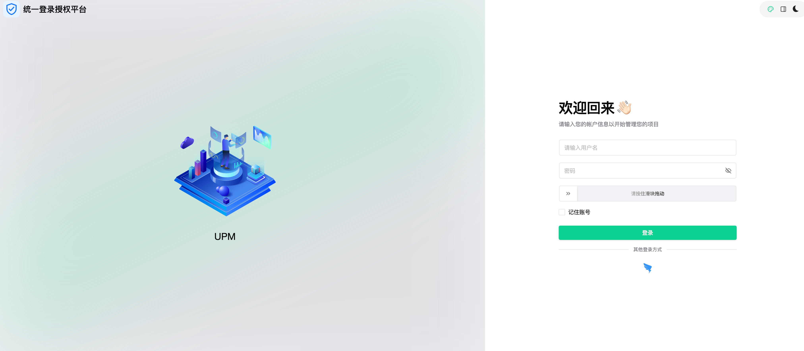
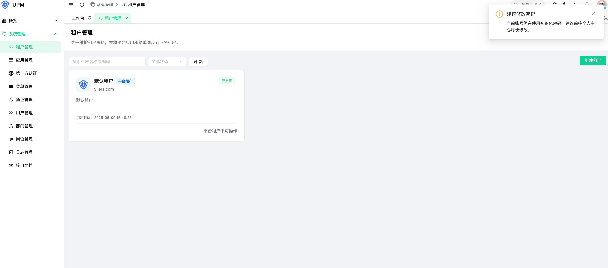
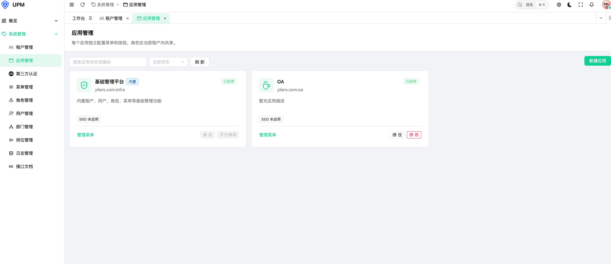
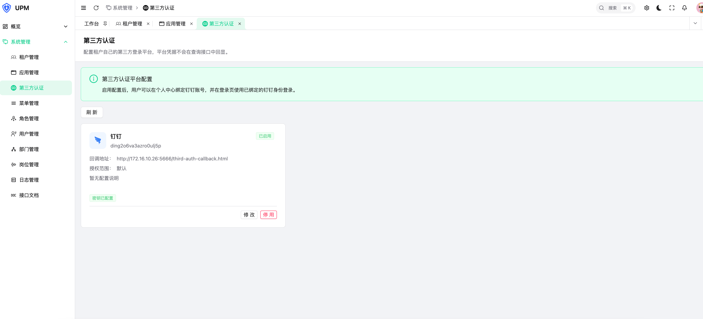
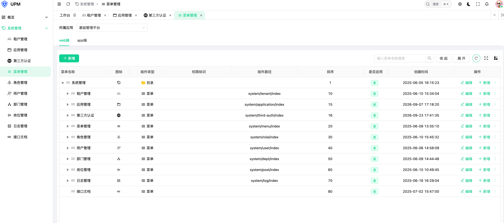
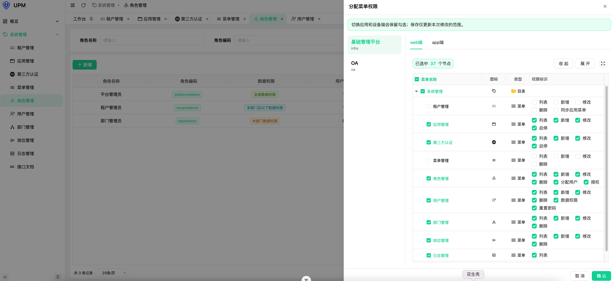
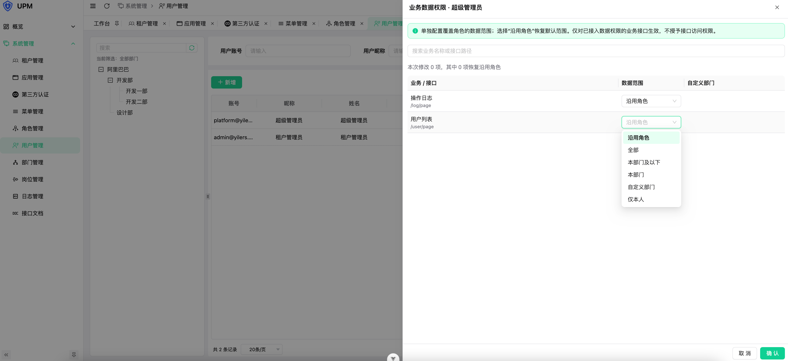
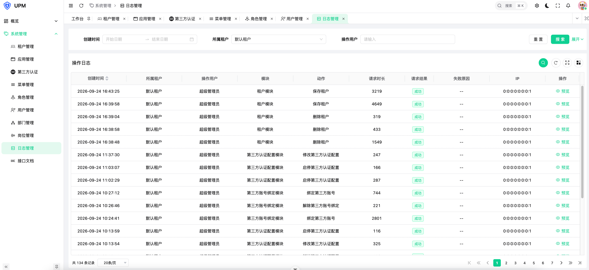
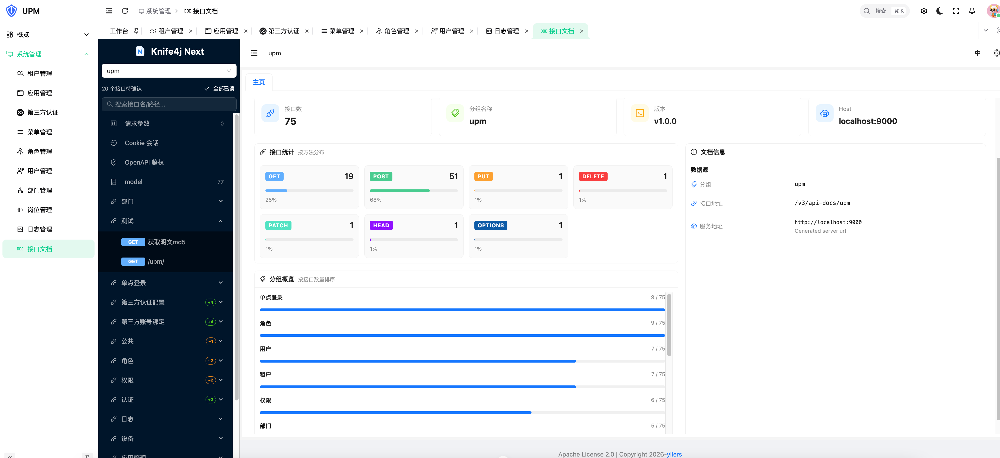

# infra-parent

infra-parent 是一套基于 Spring Boot 4 的多租户基础服务，核心提供 UPM（User Permission Management）用户权限中心。它既可以作为统一认证与权限中心独立部署，也可以通过 Maven 模块直接集成到业务系统。

项目当前已经覆盖租户、应用、组织、RBAC、数据权限、SSO 和第三方账号登录等基础能力；文件、通知和工作流模块已经预留结构，后续按独立业务能力逐步实现。

## 核心能力

- 多租户：基于 MyBatis Plus 租户插件隔离业务数据，用户登录后由服务端登录态恢复租户上下文。
- 应用管理：一个租户可以维护多个应用，应用下可继续按 Web、App 等终端配置目录、菜单和按钮。
- RBAC：角色属于租户，可同时获得多个应用的菜单按钮权限，用户通过角色获得权限。
- 组织管理：用户、部门、职位和角色统一管理。
- 数据权限：支持全部、本部门及以下、本部门、自定义部门和仅本人，并支持用户针对业务接口覆盖角色默认范围。
- 租户权限同步：租户 1 作为平台模板，可将应用和菜单按钮增量同步到其他租户。
- SSO：基于 Sa-Token SSO 模式三实现统一登录，不要求 UPM 与业务系统共享 Redis。
- 第三方登录：当前支持钉钉配置、账号绑定、解绑及已绑定账号直接登录 UPM。
- 基础能力：统一响应、异常处理、日志、缓存、分布式锁、限流和 API 文档。

## 权限模型

```text
租户
├── 应用 A
│   ├── Web 端
│   │   └── 目录 / 菜单 / 按钮
│   └── App 端
│       └── 目录 / 菜单 / 按钮
└── 应用 B
    └── Web 端
        └── 目录 / 菜单 / 按钮

用户 ──分配──> 角色 ──授权──> 不同应用、终端下的菜单按钮
```

- 应用编码在租户内唯一。
- 角色在租户内共享，不需要为每个应用重复创建角色。
- 菜单和按钮属于具体应用及终端，登录后按当前应用返回对应权限。
- 客户端不再通过请求头提供可信租户 ID，用户和租户信息从 Sa-Token 登录态中获取。

## 技术栈

| 类型 | 技术 |
| --- | --- |
| 构建 JDK | JDK 25（产物目标版本为 Java 21） |
| Web 框架 | Spring Boot 4.1.1 |
| ORM | MyBatis Plus 3.5.17 |
| 数据库 | MySQL 5.7 / 8.x（同时提供 PostgreSQL SQL 脚本） |
| 缓存 | Redis、Redisson、JetCache |
| 认证授权 | Sa-Token 1.45.0 |
| API 文档 | Knife4j-next |
| 工具库 | Hutool 7 |
| 动态线程池 | Dynamic-TP |
| 任务调度 | PowerJob |

## 项目结构

```text
infra-parent
├── common
│   ├── common-core       # 基础工具、常量和通用模型
│   ├── common-api        # 跨模块公共 API 模型
│   ├── common-auth       # Sa-Token 认证授权封装
│   ├── common-redisson   # Redisson、分布式锁和限流
│   └── common-web        # Web、MyBatis Plus、数据权限和 API 文档
├── upm
│   ├── upm-api           # UPM 实体、请求响应对象和服务契约
│   ├── upm-core          # UPM 业务、HTTP 接口、SSO Server 和内置前端
│   └── upm-start         # UPM 独立部署入口
├── file                  # 文件服务预留模块（规划中）
├── notice                # 通知服务预留模块（规划中）
├── flow                  # 工作流预留模块（规划中）
├── ai                    # AI 能力预留模块
├── infra-start           # 基础能力统一部署入口
├── doc                   # 架构与接入文档
├── sql                   # 全量初始化与增量升级脚本
└── bin                   # 本地安装和发布脚本
```

`infra-start` 用于将多个基础能力组合成一个大单体服务；`upm-start` 只启动 UPM，适合独立部署或后续微服务拆分。

前端项目独立维护在 [infra-parent-web](https://github.com/yilers/infra-parent-web)，生产构建产物会放入 `upm-core`，因此启动后端即可访问管理端页面。

## 快速开始

### 环境要求

- JDK 25
- Maven 3.9+
- MySQL 5.7 或 8.x
- Redis 6.0+

仓库同时维护 PostgreSQL 全量及增量脚本；使用 PostgreSQL 运行服务时，需要在启动模块中补充 PostgreSQL JDBC 驱动并调整数据源配置。

### 1. 初始化数据库

MySQL：

```bash
mysql -u root -p infra < sql/full/mysql.sql
```

新数据库只执行 `sql/full/` 中对应的全量脚本；已有数据库按时间顺序执行 `sql/migration/` 中尚未应用的增量脚本，不要重复执行全量脚本或已经执行过的迁移。

完整说明见 [SQL 执行说明](sql/README.md)。

### 2. 配置运行环境

统一启动时修改：

```text
infra-start/src/main/resources/application-dev.properties
```

仅启动 UPM 时修改：

```text
upm/upm-start/src/main/resources/application-dev.properties
```

至少需要配置数据库和 Redis。真实密码、第三方平台密钥及 API Key 应通过环境变量或部署平台的密钥管理功能注入，不要提交到 Git。

启用 SSO 前还需要生成用于加密客户端密钥的主密钥：

```bash
openssl rand -base64 32
export UPM_SSO_SECRET_KEY="替换为上一步生成的固定值"
```

该值必须由部署平台长期安全保存。应用密钥加密入库后不能随意重新生成，否则已有密文将无法解密。

### 3. 编译安装

```bash
mvn clean install -Drevision=1.1.0
```

也可以使用安装脚本：

```bash
cd bin
./install.sh
```

### 4. 启动服务

统一启动全部基础模块：

```bash
cd infra-start
mvn spring-boot:run -Dspring-boot.run.profiles=dev
```

只启动 UPM：

```bash
cd upm/upm-start
mvn spring-boot:run -Dspring-boot.run.profiles=dev
```

启动后访问：

- 管理端：http://localhost:9000/index.html
- API 文档：http://localhost:9000/doc.html
- 健康检查：http://localhost:9000/actuator/health

默认账号：

| 类型 | 账号 | 密码 |
| --- | --- | --- |
| 平台管理员 | `platform@yilers.com` | `yilers@123` |
| 默认租户管理员 | `admin@yilers.com` | `yilers@123` |

首次登录后建议立即修改默认密码。

## 租户与应用

租户 1 是平台模板租户，内置基础管理应用。平台管理员可以维护模板应用、菜单和按钮，并在租户管理页面预览、同步其他租户的权限差异。

创建新租户时会自动完成：

1. 创建默认部门、租户管理员角色和租户管理员账号。
2. 复制租户 1 已有的应用、终端、菜单按钮及租户管理员默认权限。
3. 保留平台菜单与模板菜单的来源关系，便于后续执行幂等增量同步。
4. 清空应用的 SSO 密钥、回调地址、注销推送地址和启用状态，避免租户之间共享客户端凭据。
5. 复制第三方认证平台模板，但不复制 Client ID、Client Secret 和回调配置。

目标租户可以继续创建自己的应用和菜单。租户自建菜单不会被平台同步覆盖。

详细规则见 [租户应用菜单同步](doc/TENANT_PERMISSION_SYNC.md)。

## SSO 单点登录

独立部署模式下，UPM 作为统一认证中心。业务系统在 UPM 中配置为租户应用，并使用以下客户端标识：

```text
{tenantCode}:{applicationCode}
```

例如：

```text
yilers.com:oa
```

应用可以配置名称、编码、Logo、首页地址、回调地址白名单、注销推送地址、SSO 开关和客户端密钥。

登录流程：

1. 业务前端跳转到 UPM 的 `/sso/authorize` 页面。
2. 用户复用现有 UPM 登录页完成登录；已有 UPM 登录态时不再输入账号密码。
3. UPM 校验租户、应用、用户权限和回调白名单，签发短时一次性 ticket。
4. 业务前端把 ticket 交给自己的后端。
5. 业务后端使用应用客户端密钥，通过 `/sso/pushS` 校验 ticket 并获取租户、应用、用户、角色、菜单、按钮及数据权限上下文。
6. 业务后端签发自己的登录 token，供本系统前端访问业务接口。

UPM 与业务系统不需要共享 Redis，客户端密钥只允许保存在业务后端。UPM token、业务 token 和一次性 ticket 的职责彼此独立。

完整协议、安全边界和接口示例见 [SSO 接入文档](doc/SSO.md)。

新业务应用的配置步骤、后端及前端代码示例、联调排查见 [SSO Client 接入指南](doc/SSO_CLIENT.md)。

## 钉钉第三方登录

第三方认证用于解决“用户如何登录 UPM”，与用于进入业务应用的 SSO 是两套不同流程。

当前已实现：

- 按租户维护钉钉 Client ID、Client Secret、授权回调地址和授权范围。
- 已登录用户在个人中心绑定、查看和解绑自己的钉钉账号。
- 登录页使用已经绑定的钉钉身份直接登录 UPM。
- 登录成功后继续签发原有 UPM token，角色、菜单、数据权限和 SSO 流程保持不变。

当前不会根据钉钉身份自动创建 UPM 用户，也不会在登录回调中同步钉钉部门和组织架构。用户必须先登录 UPM 并完成账号绑定，后续才能使用钉钉登录。

推荐授权回调地址：

```text
https://upm.example.com/third-auth-callback.html
```

完整配置、绑定及登录流程见 [第三方认证文档](doc/THIRD_AUTH.md)。

## 接入方式

### 独立部署

运行 `upm-start`，业务系统通过 HTTP 和 SSO 使用 UPM。业务数据库与 UPM 数据库可以完全独立，适合统一认证中心和多业务系统场景。

### 模块集成

业务启动器直接依赖 `upm-core`，在自己的数据库中部署 UPM 表，使用本地 Service、登录和权限能力：

```xml
<dependency>
    <groupId>io.github.yilers</groupId>
    <artifactId>upm-core</artifactId>
    <version>1.1.0</version>
</dependency>
```

只需要实体、请求响应对象或服务契约时，可以依赖 `upm-api`。建议业务模块同样采用 `api + core + start` 分层。

模块集成与独立 SSO 是两种不同部署方式：业务系统已经集成本地 `upm-core` 和 UPM 数据表时，通常直接使用本地登录，不再连接另一套独立 UPM。

## 数据权限

角色默认数据范围支持：

- 全部数据
- 本部门及以下
- 本部门
- 自定义部门
- 仅本人

用户数据权限可以针对具体业务接口覆盖角色默认范围。业务接口使用 `@DataPermissionResource` 标记可配置接口，并以 Spring 实际匹配的路由模板保存资源路径，因此 `/user/{id}` 不会退化成具体 ID 的动态地址。Mapper 使用 `@DataPermission` 声明主表、部门字段和创建人字段。

示例：

```java
@InterceptorIgnore(tenantLine = "true", dataPermission = "false")
@DataPermission(tableName = "upm_log", deptField = "dept_id", userField = "operator")
Page<LogInfoResponse> findByPage(@Param("page") Page<?> page,
                                 @Param("request") BasePageRequest<Log> request);
```

需要列权限处理的表可在配置中声明：

```properties
permission.column.table=upm_log,upm_user
```

## 文档

- [UPM 模块说明](doc/UPM.md)
- [SSO 接入设计](doc/SSO.md)
- [第三方认证设计](doc/THIRD_AUTH.md)
- [租户应用菜单同步](doc/TENANT_PERMISSION_SYNC.md)
- [基础能力模块规划](doc/modules/README.md)
- [SQL 执行说明](sql/README.md)

## 常用命令

```bash
# 完整构建
mvn clean install -Drevision=1.1.0

# 跳过测试构建
mvn clean install -DskipTests -Drevision=1.1.0

# 打包
mvn clean package -DskipTests -Drevision=1.1.0

# 显式运行测试
mvn test -DskipTests=false -Drevision=1.1.0

# 查看依赖树
mvn dependency:tree
```

## 截图












## 许可证

[Apache License 2.0](LICENSE)
